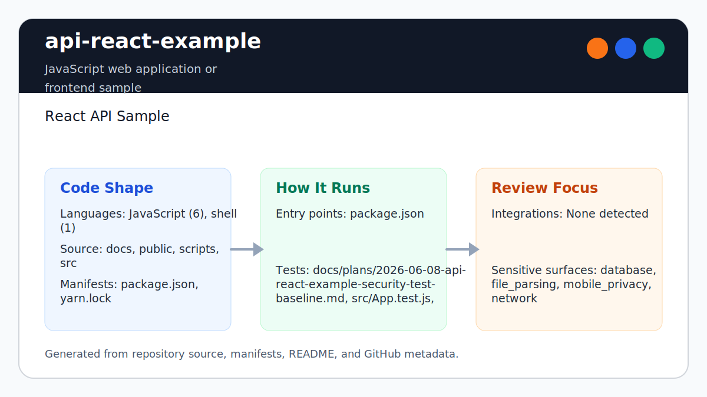

# api-react-example

<!-- README-OVERVIEW-IMAGE -->



## Overview

`garethpaul/api-react-example` is a JavaScript web application or frontend sample. React API Sample

This README is based on the checked-in source, manifests, scripts, and repository metadata on the `master` branch. The project language mix found during review was: JavaScript (6), shell (1).

## Repository Contents

- `README.md` - project overview and local usage notes
- `package.json` - JavaScript dependency and script metadata
- `docs` - source or example code
- `public` - source or example code
- `scripts` - source or example code
- `SECURITY.md` - security reporting and disclosure guidance
- `src` - source or example code
- `VISION.md` - project direction and maintenance guardrails
- `yarn.lock` - JavaScript dependency and script metadata

Additional scan context:

- Source directories: docs, public, scripts, src
- Dependency and build manifests: package.json, yarn.lock
- Entry points or build surfaces: package.json
- Test-looking files: docs/plans/2026-06-08-api-react-example-security-test-baseline.md, src/App.test.js, src/setupTests.js

## Getting Started

### Prerequisites

- Git
- Node.js 20.19 or newer
- Corepack

### Setup

```bash
git clone https://github.com/garethpaul/api-react-example.git
cd api-react-example
corepack yarn install --frozen-lockfile
```

The setup commands above are derived from repository files. Legacy mobile, Python, or JavaScript samples may require older SDKs or package versions than a modern workstation uses by default.

## Running or Using the Project

- Run `corepack yarn start` to launch the Vite development server.

Detected package scripts:

- `corepack yarn build` - create an optimized Vite production bundle
- `corepack yarn format:check` - verify formatting with Prettier
- `corepack yarn lint` - run explicit ESLint checks
- `corepack yarn start` - start the Vite development server
- `corepack yarn test` - run the Vitest component suite once
- `corepack yarn verify` - run the baseline, lint, formatting, tests, and build

## Testing and Verification

Run the source baseline, lint, tests, and production build:

```sh
make check
sh scripts/check-baseline.sh
corepack yarn lint
corepack yarn test
corepack yarn build
corepack yarn verify
```

GitHub Actions performs the frozen Yarn install and runs the same `make check`
gate on Node 20, 22, and 24 for pull requests, pushes to `master`, and manual
maintenance runs. The workflow uses Ubuntu 24.04 and cancels superseded runs.
CodeQL analyzes both the GitHub Actions and JavaScript/TypeScript surfaces on
pushes, pull requests, scheduled runs, and manual dispatches with pinned
actions and bounded read-only jobs.

When the required SDK or runtime is unavailable, use static checks and source review first, then verify on a machine that has the matching platform toolchain.

## Configuration and Secrets

- No required secret or credential file was identified in the repository scan. If you add integrations later, keep secrets out of git.

## Security and Privacy Notes

- Review changes touching network requests, sockets, or service endpoints; examples from the scan include docs/plans/2026-06-08-api-react-example-security-test-baseline.md, public/index.html, public/robots.txt, scripts/check-baseline.sh, and 5 more.
- Review changes touching file, media, JSON, XML, CSV, OCR, or data parsing; examples from the scan include docs/plans/2026-06-08-api-react-example-baseline-guard.md, docs/plans/2026-06-08-api-react-example-security-test-baseline.md, public/index.html, public/manifest.json, and 3 more.
- The current frontend toolchain uses React 19, Vite 8, Vitest 4, and explicit
  ESLint and Prettier configuration.

## Maintenance Notes

- Photo records are validated before rendering; malformed items use the existing
  error state instead of creating broken cards.
- Thumbnail URLs must parse as HTTPS URLs before the app renders image elements.
- Thumbnail URLs with embedded credentials are rejected before image elements
  are rendered.
- Thumbnails load lazily with a no-referrer policy so arbitrary image hosts do
  not receive the application page URL.
- Accepted photo titles and thumbnail URLs are normalized before they are used
  in headings, alt text, and image sources.
- Photo IDs must be unique after React key coercion before cards are rendered.
- Photo IDs must be non-empty strings or finite numbers and are normalized
  before React keys are rendered.
- Pending photo loads skip state updates after the component unmounts.
- Pending photo loads are aborted when the component unmounts on browsers that
  support `AbortController`.
- Photo requests time out after 10 seconds, abort when supported, and leave the
  loading state through the existing user-visible error path.
- Each photo request owns its timeout and abort controller, and only the active
  request may update state or clear current request resources after a remount.
- See `docs/plans/2026-06-09-photo-fetch-abort-guard.md` for the pending photo
  fetch abort guard.
- See `docs/plans/2026-06-10-photo-request-timeout.md` for the bounded request
  and timer cleanup contract.
- See `SECURITY.md` for vulnerability reporting and safe research guidance.
- See `docs/plans/2026-06-08-api-react-example-check-wrapper.md` for the root
  verification wrapper baseline.
- See `docs/plans/2026-06-09-photo-thumbnail-url-validation.md` for the HTTPS
  thumbnail validation baseline.
- See `docs/plans/2026-06-09-photo-thumbnail-credential-validation.md` for the
  thumbnail credential validation baseline.
- See `docs/plans/2026-06-09-photo-render-field-normalization.md` for the render
  field normalization baseline.
- See `docs/plans/2026-06-09-photo-duplicate-id-validation.md` for the duplicate
  photo ID validation baseline.
- See `docs/plans/2026-06-09-photo-id-type-validation.md` for the key-safe photo
  ID type validation baseline.
- See `docs/plans/2026-06-09-photo-unmount-state-guard.md` for the async unmount
  state-update guard.
- See `VISION.md` for project direction and contribution guardrails.
- See `CHANGES.md` for the maintenance history.

## Contributing

Keep changes small and tied to the project that is already present in this repository. For code changes, document the toolchain used, avoid committing generated dependency directories or local configuration, and update this README when setup or verification steps change.
